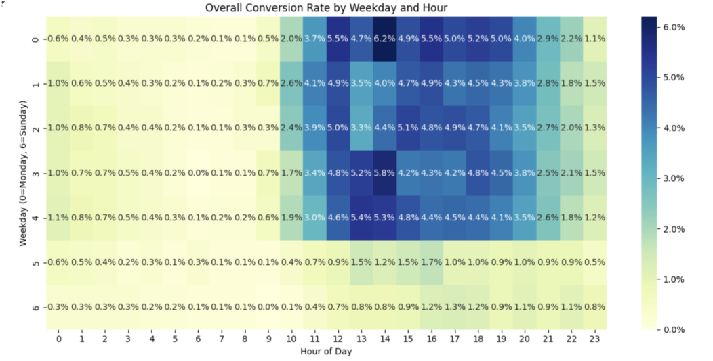
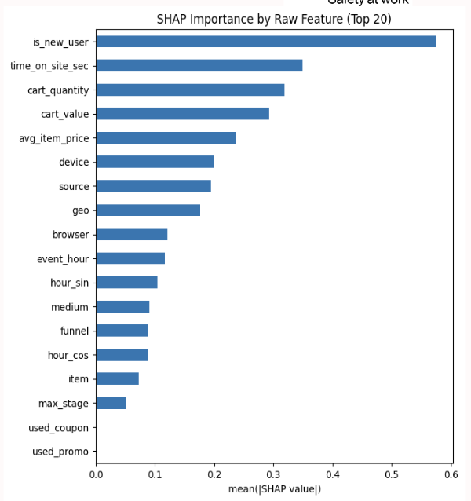

# Capstone Project: Purchase Funnel Optimization & Predictive Modeling  

## 📌 Project Overview  
This project investigates user behavior on **Magid’s e-commerce platform**, with the goal of improving conversion efficiency across the purchase funnel. Using integrated data from **Google Analytics 4 (GA4)**, **Magento**, and **BigQuery**, we tracked over 700,000 sessions to identify drop-off points, analyze behavioral patterns, and build predictive models for purchase likelihood and abandoned-cart recovery.  

Key objectives:  
- Diagnose where and why users abandon the funnel.  
- Develop predictive models to anticipate purchase and reconversion.  
- Provide actionable recommendations for UX and marketing teams.  

---

## 📂 Repository Structure  

- **Week1_Code.ipynb** – Funnel foundations & diagnostics (by product type and price tier).  
- **Week2/** – Multi-session & time-to-conversion analysis  
  - `Week2.ipynb` – Main Week 2 analysis notebook  
  - `MagidConversionTimeModels.ipynb` – Conversion timing models  
  - `avg_time_to_conversion_by_segments.ipynb` – Segmented conversion timing exploration  
  - `feature_engineering_time_to_conversion_modeling.ipynb` – Feature construction for time-to-conversion models  
  - `session_behaviours_initial_vs_returned.ipynb` – First vs. returning session behaviors  
  - `session_sequence_funnel.ipynb` – Session-level funnel sequence analysis  
  - `test.ipynb` – Testing/experiments  
  - `decision_tree_classifier.png`, `tree_structure_new.png` – Visual outputs  
- **Week3_Code.ipynb** – Funnel benchmarking by channel, weekday, and hour.  
- **Week4_code.ipynb** – Customer journey clustering & typology identification.  
- **Week6/** – Abandoned-cart prediction & lead scoring  
  - `Week6_Code.ipynb` – Main Week 6 modeling notebook  
  - `Week6_Code_Newdata_Olddata.ipynb` – Extended experiments with different datasets  
  - `abandon_lead_scores.csv` – Predicted lead scores for abandoned checkouts  
  - `abandon_retargting_topN.csv` – Ranked list for retargeting  
  - `abandon_top5pct.csv`, `abandon_top10pct.csv`, `abandon_top20pct.csv` – High-probability reconversion segments  
- **Prediction_Model.ipynb** – Final integrated predictive modeling (Logistic Regression, Random Forest, XGBoost).  
- **images/** – Visualization outputs for README and report (funnel heatmaps, clustering, SHAP plots, etc.).  
- **README.md** – Project documentation.  

---

## 📊 Key Findings  

- **Largest drop-off**: *view_item → add_to_cart*, only ~15% conversion.  
- **Price sensitivity**: Low-priced items (<$50) convert at ~6%, premium items (≥$300) at ~1.5%.  
- **User segmentation**: Logged-in users and longer sessions drive disproportionately higher conversions.  
- **Journey typologies**: Identified “Impulse Buyers” and “Researchers,” requiring differentiated strategies.  
- **Abandoned-cart prediction**: XGBoost achieved the best performance (Precision-Recall AUC = 0.22).  
  - Top 5% abandoned carts → **2.9× lift** over baseline conversion.  
  - Top 10–20% segments → **2.3–2.5× lift**.  

---

## 🛠️ Methods & Tools  

- **Data Sources**: GA4, Magento, BigQuery.  
- **Tech Stack**: Python, Pandas, Scikit-learn, XGBoost.  
- **Modeling**: Logistic Regression, Random Forest, Gradient Boosting (XGBoost), clustering (K-means / embeddings).  
- **Visualization**: Funnel heatmaps, benchmarking dashboards, SHAP interpretability.  

---

## 📊 Key Visualizations  

Funnel Drop-off (largest abandonment between *view_item* and *add_to_cart*):  
  

Conversion rates peak during **afternoon and early evening hours**, especially between **12 PM and 2 PM**.  
Weekday performance is relatively stable from **Monday to Friday**, but drops noticeably on **weekends**.  

Feature Importance for Abandoned Checkout Prediction (SHAP values):  
  

---

## 🎯 Business Recommendations  

1. Prioritize **high-value, late-stage abandoners** for remarketing.  
2. Differentiate incentives: stronger offers for new users, gentle reminders for returning users.  
3. Reallocate ad budget from underperforming paid channels to **organic and direct traffic**.  
4. Schedule remarketing during **weekday evenings** when reconversion rates peak.  

---

## 👩‍💻 Authors  

- Yahui Qian  
- Kathy Liu  
- Shitong Liu  
- Chenyi Zhao  

---
